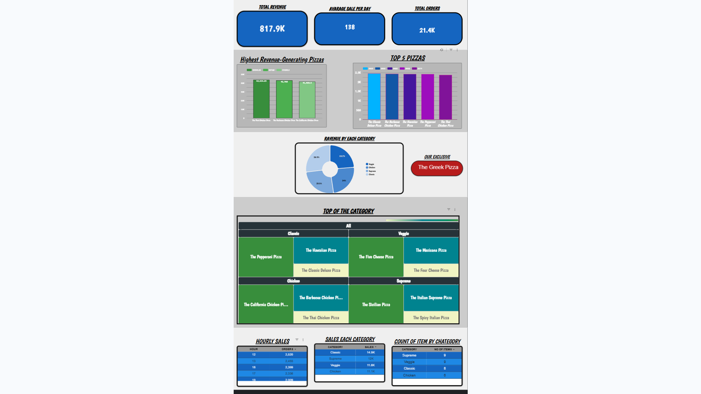

# 🍕 Pizza Sales Analysis

This project analyzes a pizza sales dataset using **SQL** and visualizes insights with **Looker Studio**.  
It demonstrates real-world data analytics skills such as querying, aggregations, and dashboard creation.

---

## 📂 Project Structure

---

## ⚙️ Tools & Skills Used
- **SQL** (BigQuery-compatible queries)
- **Looker Studio** for dashboards
- **Data analysis**: Joins, aggregations, ranking, filtering

---

## 📊 Key Insights
- Identified **top-selling pizzas** and categories  
- Found **peak sales hours** and customer order patterns  
- Analyzed **revenue contribution** by pizza type  
- Built interactive dashboard for management  

---

## 🖼️ Dashboard Preview

---

## 📖 How to Use
1. Check the **dataset/** folder for raw sales data.  
2. Explore **results/** to see the SQL outputs.  
3. View dashboards in **assets/** for visual insights.  

---

## 👤 Author
**Arin Chakraborty**  
🔗 [GitHub Profile](https://github.com/SKYHAWK19) | [LinkedIn](www.linkedin.com/in/
arin-chakraborty-664531233
)

---
